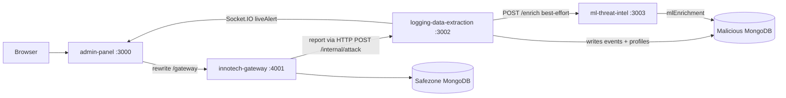

# InnoTech Honeypot — Codebase map

Quick navigation for developers. For attack demos and trap walkthroughs, see [README.md](../README.md#attack-demo-guide). For deploy, see [DEPLOYMENT.md](./DEPLOYMENT.md).

## Monorepo layout

| Path | Role |
|------|------|
| [`admin-panel/`](../admin-panel/) | Next.js UI (port 3000), proxies `/gateway/*` to the honeypot gateway |
| [`services/innotech-gateway/`](../services/innotech-gateway/) | Express + EJS HR portal, gatekeeper, traps (port 4001) |
| [`services/logging-data-extraction/`](../services/logging-data-extraction/) | Telemetry API, Mongo writes, Socket.IO live alerts (port 3002) |
| [`services/ml-threat-intel/`](../services/ml-threat-intel/) | Hugging Face ML enrichment (`POST /enrich`, port 3003) — see [ML_THREAT_INTEL.md](./ML_THREAT_INTEL.md) |
| [`packages/shared-constants/`](../packages/shared-constants/) | `TRAP_TYPES` enum (gateway + telemetry + admin) |
| [`packages/shared-utils/`](../packages/shared-utils/) | `getAttackerIp` and shared helpers |
| [`packages/db-schemas/`](../packages/db-schemas/) | Mongoose schemas (malicious DB, `AdminUser`, `RealEmployee`) |
| [`infra/`](../infra/) | Nginx, Docker Compose, AWS Terraform |
| [`scripts/`](../scripts/) | [`yaniv-test/`](../scripts/yaniv-test/) remote trap simulation (`pnpm trap:demo`) |

## Where to find things

| I need… | Location |
|---------|----------|
| Trap detection / gatekeeper | [`services/innotech-gateway/middleware/gatekeeper.js`](../services/innotech-gateway/middleware/gatekeeper.js) |
| SQLi / XSS pattern lists | [`services/innotech-gateway/services/detectionService.js`](../services/innotech-gateway/services/detectionService.js) |
| Trap handlers | [`services/innotech-gateway/traps/`](../services/innotech-gateway/traps/) |
| Decoy EJS pages | [`services/innotech-gateway/views/decoy/`](../services/innotech-gateway/views/decoy/) |
| HR portal (real employee UI) | [`services/innotech-gateway/views/`](../services/innotech-gateway/views/) (non-decoy) |
| Route to trap after detection | [`services/innotech-gateway/middleware/decoyReroute.js`](../services/innotech-gateway/middleware/decoyReroute.js) |
| Persist attack + live alert | [`services/logging-data-extraction/routes/internal.js`](../services/logging-data-extraction/routes/internal.js) (`POST /internal/attack`) |
| Socket.IO broadcast | [`services/logging-data-extraction/services/SocketService.js`](../services/logging-data-extraction/services/SocketService.js) |
| Malicious DB connection (telemetry-only) | [`services/logging-data-extraction/config/maliciousDb.js`](../services/logging-data-extraction/config/maliciousDb.js) via [`packages/db-schemas/connect.js`](../packages/db-schemas/connect.js) |
| Blue Team dashboard UI | [`admin-panel/features/dashboard/`](../admin-panel/features/dashboard/) |
| Investigation / timeline UI | [`admin-panel/features/investigation/`](../admin-panel/features/investigation/) |
| Admin REST API | [`admin-panel/app/api/admin/`](../admin-panel/app/api/admin/) |
| Portal session / role gate | [`admin-panel/app/api/portal/session/route.ts`](../admin-panel/app/api/portal/session/route.ts) |
| Dashboard URL protection (Edge) | [`admin-panel/middleware.ts`](../admin-panel/middleware.ts), [`admin-panel/lib/auth/portalAccessEdge.ts`](../admin-panel/lib/auth/portalAccessEdge.ts) |
| JWT / TOTP (Node) | [`admin-panel/lib/auth/`](../admin-panel/lib/auth/) |
| Central env file | [`admin-panel/.env`](../admin-panel/.env) (see [`.env.example`](../admin-panel/.env.example)) |
| Shared Mongoose schemas | [`packages/db-schemas/`](../packages/db-schemas/) |
| Production deploy | [DEPLOYMENT.md](./DEPLOYMENT.md) |
| Protected admin aliases | `/admin/map`, `/admin/ban` → dashboard tabs |

## Database schemas (spec)

| Spec | Model | Collection | Package path |
|------|-------|------------|--------------|
| `ADMIN_USER` | `AdminUser` | `admin_users` | [`packages/db-schemas/admin/AdminUser.js`](../packages/db-schemas/admin/AdminUser.js) |
| `REAL_EMPLOYEE` | `RealEmployee` | `real_employees` | [`packages/db-schemas/safezone/RealEmployee.js`](../packages/db-schemas/safezone/RealEmployee.js) |
| Attacker intel | `AttackerProfile`, `AttackEvent`, `HoneyToken` | malicious DB | [`packages/db-schemas/malicious/`](../packages/db-schemas/malicious/) |

Legacy `users` collection: migrate with [`scripts/migrate-users-to-real-employees.js`](../scripts/migrate-users-to-real-employees.js).

## Runtime flow



## Local development

```bash
pnpm install
pnpm dev:full
```

- Browser: http://localhost:3000/gateway/
- Env: `admin-panel/.env` (`SAFEZONE_DB_URI`, `MALICIOUS_DB_URI`, socket tokens, `DEV_PUBLIC_HOST`)

## Trap simulation (optional)

```bash
pnpm trap:demo
pnpm trap:chain
```

See [scripts/yaniv-test/README.md](../scripts/yaniv-test/README.md). Manual QA checklist: [QA_MASTER_CHECKLIST.md](./QA_MASTER_CHECKLIST.md).
