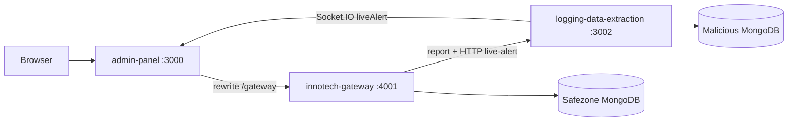

# InnoTech Honeypot — Codebase map

Quick navigation for developers. For attack demos and trap walkthroughs, see [README.md](../README.md) and [ATTACK_DEMO_GUIDE.md](./ATTACK_DEMO_GUIDE.md).

## Monorepo layout

| Path | Role |
|------|------|
| [`apps/admin-panel/`](../apps/admin-panel/) | Next.js UI (port 3000), proxies `/gateway/*` to the honeypot gateway |
| [`services/innotech-gateway/`](../services/innotech-gateway/) | Express + EJS HR portal, gatekeeper, traps (port 4001) |
| [`services/logging-data-extraction/`](../services/logging-data-extraction/) | Telemetry API, Mongo writes, Socket.IO live alerts (port 3002) |
| [`packages/shared-constants/`](../packages/shared-constants/) | `TRAP_TYPES` enum (gateway + telemetry + admin) |
| [`packages/shared-utils/`](../packages/shared-utils/) | `getAttackerIp` and shared helpers |
| [`packages/db-schemas/`](../packages/db-schemas/) | Mongoose schemas (malicious DB, admin users, safezone users) |
| [`scripts/`](../scripts/) | [`yaniv-test/`](../scripts/yaniv-test/) remote trap simulation (`pnpm trap:demo`) |

## Where to find things

| I need… | Location |
|---------|----------|
| Trap detection / gatekeeper | [`services/innotech-gateway/middleware/gatekeeper.js`](../services/innotech-gateway/middleware/gatekeeper.js) |
| SQLi / XSS pattern lists | [`services/innotech-gateway/services/detectionService.js`](../services/innotech-gateway/services/detectionService.js) |
| Trap handlers | [`services/innotech-gateway/traps/`](../services/innotech-gateway/traps/) |
| Decoy EJS pages | [`services/innotech-gateway/views/decoy/`](../services/innotech-gateway/views/decoy/) |
| HR portal (real employee UI) | [`services/innotech-gateway/views/`](../services/innotech-gateway/views/) (non-decoy) |
| Route to trap after detection | [`services/innotech-gateway/middleware/decoyReroute.js`](../services/innotech-gateway/middleware/decoyReroute.js) |
| Persist attack + live alert | [`services/logging-data-extraction/middlewares/telemetryTracker.js`](../services/logging-data-extraction/middlewares/telemetryTracker.js) |
| Socket.IO broadcast | [`services/logging-data-extraction/services/SocketService.js`](../services/logging-data-extraction/services/SocketService.js) |
| Malicious DB connection | [`services/logging-data-extraction/config/maliciousDb.js`](../services/logging-data-extraction/config/maliciousDb.js) |
| Blue Team dashboard UI | [`apps/admin-panel/features/dashboard/`](../apps/admin-panel/features/dashboard/) |
| Investigation / timeline UI | [`apps/admin-panel/features/investigation/`](../apps/admin-panel/features/investigation/) |
| Admin REST API | [`apps/admin-panel/app/api/admin/`](../apps/admin-panel/app/api/admin/) |
| Portal session / role gate | [`apps/admin-panel/app/api/portal/session/route.ts`](../apps/admin-panel/app/api/portal/session/route.ts) |
| Dashboard URL protection (Edge) | [`apps/admin-panel/middleware.ts`](../apps/admin-panel/middleware.ts), [`apps/admin-panel/lib/auth/portalAccessEdge.ts`](../apps/admin-panel/lib/auth/portalAccessEdge.ts) |
| JWT / TOTP (Node) | [`apps/admin-panel/lib/auth/`](../apps/admin-panel/lib/auth/) |
| Central env file | [`apps/admin-panel/.env.local`](../apps/admin-panel/.env.local) (see `.env.local.example`) |
| Shared Mongoose schemas | [`packages/db-schemas/`](../packages/db-schemas/) |

## Runtime flow



## Local development

```bash
pnpm install
pnpm dev:full
```

- Browser: http://localhost:3000/gateway/
- Env: `apps/admin-panel/.env.local` (`SAFEZONE_DB_URI`, `MALICIOUS_DB_URI`, socket tokens, `DEV_PUBLIC_HOST`)

## Trap simulation (optional)

```bash
pnpm trap:demo
pnpm trap:chain
```

See [scripts/yaniv-test/README.md](../scripts/yaniv-test/README.md). Manual QA checklist: [QA_MASTER_CHECKLIST.md](./QA_MASTER_CHECKLIST.md).
