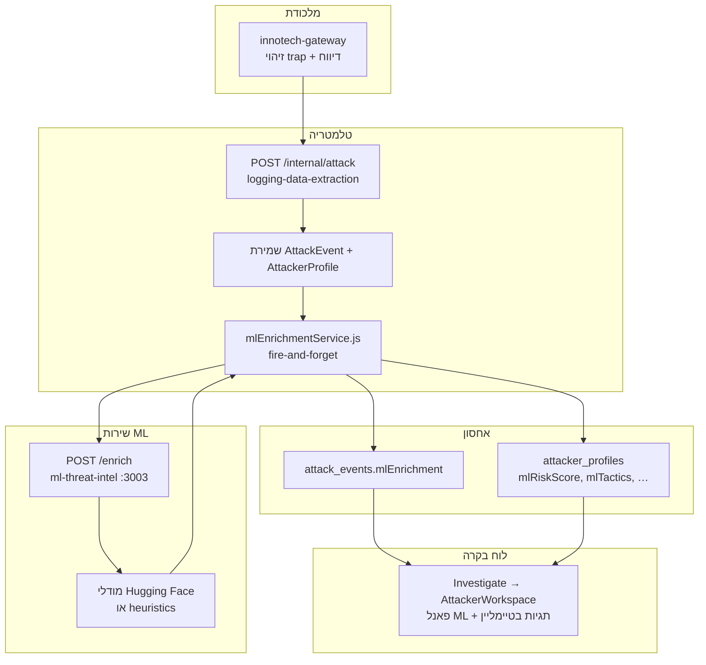

# ML Threat Intel — שימוש במודלי Hugging Face

מסמך זה מסכם איך פלטפורמת Evation משלבת **שבעה מודלים מ-Hugging Face** לזיהוי ועשרת אירועי תקיפה מה-honeypot, איך התוצאות נשמרות במסד הנתונים, ואיך הן מוצגות בלוח הבקרה (Investigate).

לפרטים טכניים של השירות עצמו (API, הרצה מקומית, Docker): [`services/ml-threat-intel/README.md`](../services/ml-threat-intel/README.md).

---

## למה זה קיים

כשתוקף נתקע במלכודת (SQLi, XSS, recon, honey token וכו'), המערכת כבר יודעת **מה** קרה — סוג ה-trap, ה-payload, ה-IP. מודלי Hugging Face מוסיפים שכבת **הקשר איומים**:

- האם ה-payload באמת זדוני (ולא רק התאמה ל-regex)?
- איזו **טקטיקת MITRE ATT&CK** מתאימה לפעולה?
- אילו **טכניקות** (T1190, T1059 וכו') הכי קרובות לתיאור האירוע?
- האם יש **ייחוס לקבוצת תקיפה** (APT / commodity scanner)?
- **חתימת סגנון** (SecBERT) לקישור בין אירועים מאותו תוקף גם ב-IP שונה.

העשרה זו **לא חוסמת** את צינור הטלמטריה: אם שירות ה-ML כבוי, איטי או נופל — האירוע נשמר בכל מקרה, והמערכת עוברת ל-heuristics דטרמיניסטיים.

---

## זרימת נתונים (מקצה לקצה)



**סדר הפעולות:**

1. Gateway מדווח על trap ל-`POST /internal/attack`.
2. הטלמטריה שומרת את האירוע (מקור האמת).
3. מיד אחרי השמירה: `void enrichEventSafe(doc, body)` — קריאה אסינכרונית ל-`POST /enrich`.
4. שירות ה-ML מרכיב טקסט מהאירוע (trap, method, path, payload, UA, רצף traps) ומריץ את המודלים הזמינים.
5. התוצאה נכתבת ל-`AttackEvent.mlEnrichment` ומצטברת ב-`AttackerProfile` (ציון סיכון מקסימלי, טקטיקות, שחקן איום, חתימות סגנון).

---

## שבעת המודלים — תפקיד ותוצר

| מפתח | מודל Hugging Face | סוג | מה הוא מייצר |
|------|-------------------|-----|--------------|
| `payload` | [redauzhang/common-injection-payload-classfication](https://huggingface.co/redauzhang/common-injection-payload-classfication) | CodeBERT — סיווג payload | `payload.label` (malicious/benign), `attackType`, `confidence` |
| `payload_sqli_xss` | [Dr-KeK/sqli-xss-models](https://huggingface.co/Dr-KeK/sqli-xss-models) | BERT/DistilBERT — SQLi+XSS | אותו שדה `payload` (מודל ממוקד יותר ל-SQLi/XSS) |
| `log` | [Shoriful025/cyber_threat_log_classifier](https://huggingface.co/Shoriful025/cyber_threat_log_classifier) | RoBERTa — לוג HTTP | `log.label`, `log.confidence` — סיווג איום ברמת הבקשה |
| `mitre_tactic` | [sarahwei/MITRE-v15-tactic-bert-case-based](https://huggingface.co/sarahwei/MITRE-v15-tactic-bert-case-based) | BERT — טקטיקות MITRE v15 | `mitre.tactic`, `mitre.tacticConfidence` |
| `attack_bert` | [basel/ATTACK-BERT](https://huggingface.co/basel/ATTACK-BERT) | Sentence-Transformer | `mitre.techniques[]` — דמיון לטכניקות ATT&CK (T1190, T1059, …) |
| `secbert` | [jackaduma/SecBERT](https://huggingface.co/jackaduma/SecBERT) | אנקודר אבטחה | `styleSignature` — hash לקישור תוקפים בין IP-ים |
| `cyber_groups` | [selfconstruct3d/mpnet-classification-finetuned-cyber-groups](https://huggingface.co/selfconstruct3d/mpnet-classification-finetuned-cyber-groups) | MPNet — קבוצות CTI | `threatActor.group`, `candidates[]`, `confidence` |

**איך המודלים משתלבים באובייקט אחד (`MlEnrichment`):**

| שדה | מקור |
|-----|------|
| `riskScore` (0–100) | שילוב חומרת ה-trap + ביטחון המודלים + bot / אורך שרשרת |
| `severity` | `benign` / `suspicious` / `malicious` — נגזר מ-`riskScore` |
| `engine` | `ml` — כל הסיגנלים ממודלים; `heuristic` — ללא מודלים; `hybrid` — שילוב |
| `modelsUsed` | רשימת repos של HF שתרמו לתוצאה |

הגדרת המודלים נמצאת ב-[`catalog.py`](../services/ml-threat-intel/catalog.py); טעינה עצלה ובידוד שגיאות ב-[`model_registry.py`](../services/ml-threat-intel/model_registry.py); אורכיסטרציה ב-[`enrichment.py`](../services/ml-threat-intel/enrichment.py).

---

## Fallback (heuristics)

כאשר `ML_ENABLE_MODELS=false` (ברירת המחדל ב-Docker) או כשמודל ספציפי נכשל בטעינה:

- **Payload** — דפוסי regex + מיפוי לפי `trapType`.
- **MITRE** — מיפוי קבוע `trapType → technique` (למשל `SQLI → T1190`, `XSS → T1059.007`) מתוך [`catalog.py`](../services/ml-threat-intel/catalog.py).
- **Threat actor** — רמזים מ-User-Agent ורצף traps (למשל סורק אוטומטי).
- **Risk score** — משקלים לפי `TRAP_SEVERITY` + בונוסים ל-bot ולשרשרת.

השירות נשאר זמין; ה-UI מציג את שדה `engine` (`heuristic` / `hybrid` / `ml`) כדי שיהיה ברור מאיפה הגיעה ההמלצה.

---

## איך זה בא לידי ביטוי במוצר

### מסד נתונים (MongoDB — malicious)

**לכל אירוע** — תת-מסמך `mlEnrichment` על `AttackEvent`:

```text
riskScore, severity, engine
payload { label, attackType, confidence, model }
log { label, confidence, model }
mitre { tactic, tacticConfidence, techniques[], model }
threatActor { group, confidence, candidates[], model }
styleSignature, modelsUsed[], computedAt
```

סכימה: [`packages/db-schemas/malicious/mlEnrichment.js`](../packages/db-schemas/malicious/mlEnrichment.js).

**ברמת תוקף** — שדות מצטברים על `AttackerProfile`:

| שדה | משמעות |
|-----|--------|
| `mlRiskScore` | הציון הגבוה ביותר שנצפה |
| `mlSeverity` | החומרה הגרועה ביותר |
| `mlTactics` | איחוד טקטיקות MITRE לאורך כל האירועים |
| `mlThreatActor` / `mlThreatActorConfidence` | ייחוס שחקן איום הטוב ביותר |
| `mlStyleSignatures` | חתימות SecBERT לקורלציה |
| `mlModelsUsed` | איחוד repos ששימשו |

### לוח בקרה — Investigate

ב-[`AttackerWorkspace.tsx`](../admin-panel/features/investigation/components/AttackerWorkspace.tsx):

1. **פאנל "ML threat intel"** בכרטיס הפרופיל — ציון סיכון, severity, טקטיקות MITRE, עד 4 טכניקות, שחקן איום, ורשימת מודלים (שם קצר של ה-repo).
2. **תגית `ML` בכל אירוע בטיימליין** — severity, סוג התקיפה מה-payload, טכניקה מובילה.
3. **רמזי למידה** — `mlHints()` ב-[`attackIntel.ts`](../admin-panel/lib/attackIntel.ts) מוסיף משפטים כמו "ML severity: malicious" או "Possible threat-actor profile: …" לצד הרמזים הקיימים מ-regex.

סיכום ברמת תוקף: `summarizeMl(events)` מאגד את כל ה-`mlEnrichment` מהאירועים (מקסימום risk, איחוד טקטיקות/טכניקות, שחקן איום עם הביטחון הגבוה).

---

## הגדרות סביבה

| משתנה | שירות | ברירת מחדל | תיאור |
|--------|--------|------------|--------|
| `ML_ENRICHMENT_ENABLED` | telemetry | `true` | כיבוי מוחלט של הגשר ל-ML |
| `ML_SERVICE_URL` | telemetry | `http://ml-threat-intel:3003` | כתובת שירות ה-enrich |
| `ML_ENRICHMENT_TIMEOUT_MS` | telemetry | `8000` | timeout לקריאת `/enrich` |
| `ML_ENABLE_MODELS` | ml-threat-intel | `false` | `true` = טעינת torch/transformers ומשקולות HF |
| `ML_ENABLED_MODELS` | ml-threat-intel | כל 7 המפתחות | רשימה מופרדת בפסיקים — תת-קבוצה בלבד |
| `ADMIN_SOCKET_TOKEN` | שניהם | — | Bearer לאימות `POST /enrich` |

דוגמה ב-[`infra/.env.example`](../infra/.env.example). ב-Docker: שירות `ml-threat-intel` ב-[`infra/docker-compose.yml`](../infra/docker-compose.yml); משקולות נשמרות ב-volume `ml-hf-cache`.

**הפעלת מודלים אמיתיים:**

```bash
# ב-infra/.env
ML_ENABLE_MODELS=true

cd infra && docker compose up --build -d
```

בהפעלה ראשונה עם מודלים — הורדת weights מ-Hugging Face עלולה לקחת זמן ודיסק (מומלץ לבחור תת-קבוצה דרך `ML_ENABLED_MODELS`).

---

## בדיקה מהירה

```bash
# שירות ML ישירות
curl -s -X POST http://localhost:3003/enrich \
  -H "Authorization: Bearer admin-secret" \
  -H "Content-Type: application/json" \
  -d '{"trapType":"SQLI","payload":"admin'\'' OR 1=1--","path":"/gateway/login","trapSequence":["RECON","SQLI"]}' | jq

# סטטוס מודלים
curl -s http://localhost:3003/models | jq

# בדיקת routes כללית (כולל gateway + socket)
./scripts/route-smoke.sh
```

אחרי trap אמיתי או `pnpm trap:demo` — פתח **Investigate** לפי IP וודא שמופיעים פאנל ML ותגיות באירועים (גם במצב heuristic יופיע `engine: heuristic`).

---

## עקרונות עיצוב

| עקרון | יישום |
|--------|--------|
| **Best-effort** | `enrichEventSafe` בולע שגיאות; הכתיבה ל-Mongo לא תלויה ב-ML |
| **Lazy load** | מודלים נטענים בבקשה הראשונה — cold start מהיר |
| **בידוד כשלים** | כל repo ב-try/except נפרד; כשל מודל אחד לא מפיל את השירות |
| **אבטחת supply chain** | רק repos מוגדרים ב-`catalog.py`; העדפת `safetensors` |
| **שקיפות** | כל שדה מציין `model` (repo או `heuristic`); `engine` ברמת האירוע |

---

## קבצים מרכזיים

| נתיב | תפקיד |
|------|--------|
| [`services/ml-threat-intel/`](../services/ml-threat-intel/) | שירות FastAPI + כל לוגיקת HF |
| [`services/logging-data-extraction/services/mlEnrichmentService.js`](../services/logging-data-extraction/services/mlEnrichmentService.js) | גשר telemetry → ML → Mongo |
| [`services/logging-data-extraction/routes/internal.js`](../services/logging-data-extraction/routes/internal.js) | נקודת החיבור אחרי `recordEvent` |
| [`admin-panel/lib/attackIntel.ts`](../admin-panel/lib/attackIntel.ts) | `summarizeMl`, `mlHints`, צבעי severity |
| [`admin-panel/lib/types/telemetry.ts`](../admin-panel/lib/types/telemetry.ts) | טיפוסי TypeScript ל-ML |
| [`admin-panel/features/investigation/components/AttackerWorkspace.tsx`](../admin-panel/features/investigation/components/AttackerWorkspace.tsx) | UI |

---

## בעלות

תכנון ומימוש: **Yaniv** — Admin Dashboard, API, investigation UI, ושירות ML threat-intel.
